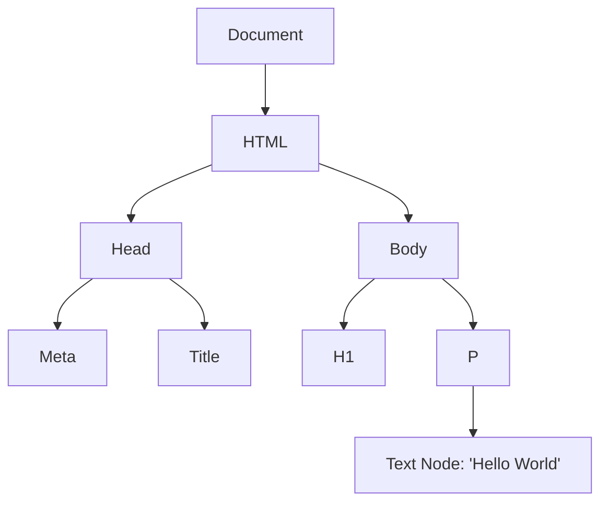

# Parsing (HTML Tokenization & DOM Construction)

When you navigate to a web page, the server responds with a stream of raw HTML bytes. But the browser cannot display raw bytes. It must convert this data into a structured format it can understand and manipulate. This is where **Parsing** and the creation of the **Document Object Model (DOM)** come in.

This process is the very first step in the Critical Rendering Path.

---

## 1. The Conversion Pipeline: From Bytes to the DOM

The browser follows a strict, four-step process to translate HTML into the DOM tree.

### Step 1: Conversion (Bytes to Characters)
The browser receives raw bytes of data from the network (e.g., `3C 68 74 6D 6C 3E...`) and translates them into individual characters (e.g., `<html>...`) based on the specified character encoding (usually UTF-8).

### Step 2: Tokenization (Characters to Tokens)
The browser feeds these characters into a State Machine (the HTML tokenizer). It looks for characters enclosed in angle brackets (`<` and `>`) and converts them into distinct **tokens** according to the W3C HTML5 standard.

*Example Tokens:* `StartTag: html`, `StartTag: head`, `EndTag: head`, `StartTag: body`, `Character: Hello World`, `EndTag: body`, `EndTag: html`.

### Step 3: Lexing (Tokens to Nodes)
As tokens are emitted, they are converted into "Objects" (Nodes) that have specific properties and rules. 
- A `StartTag: body` token becomes a `HTMLBodyElement` node.
- A `Character: Hello` token becomes a `TextNode`.

### Step 4: DOM Construction (Nodes to the DOM Tree)
HTML markup inherently defines relationships (tags inside other tags). As nodes are created, they are linked together in a tree data structure that captures the parent-child relationships established in the original HTML.

This final tree is the **Document Object Model (DOM)**.



---

## 2. Parsing Characteristics

HTML parsing is unique compared to parsing strict languages like XML or JSON. 

### Fault Tolerance (Graceful Degradation)
HTML parsers are notoriously forgiving. If a developer forgets to close a `<p>` tag, or puts a `<td>` outside of a `<table>`, the browser will not crash. Instead, it uses a complex set of error-handling rules (defined by the HTML5 spec) to "guess" the author's intent and fix the DOM tree automatically.

### Reentrancy and `document.write()`
Parsing HTML is a reentrant process. This means that while the parser is running, a script can execute `document.write('<div>New Content</div>')`. The parser will pause, process the newly injected HTML tokens, and then resume where it left off. *(Note: Using `document.write()` is heavily discouraged in modern web development due to massive performance penalties).*

---

## 3. The Render-Blocking Nature of JavaScript

While building the DOM, what happens if the parser encounters a `<script>` tag?

```html
<p>First Paragraph</p>
<script src="app.js"></script>
<p>Second Paragraph</p>
```

**The parser must STOP.**

By default, JavaScript is **parser-blocking**. Because JavaScript has the power to alter the DOM (via `document.getElementById()`, `document.write()`, etc.), the browser halts HTML parsing, downloads the script, executes it, and *only then* resumes building the DOM.

### Why this kills performance:
If `app.js` takes 2 seconds to download over a slow 3G connection, the user will stare at a blank screen (or just the "First Paragraph") for 2 seconds. The browser refuses to parse the "Second Paragraph" until the script finishes.

### How to fix it: `async` and `defer`

Modern web development relies on attributes to tell the browser not to block the parser.

- **`<script defer>`**: Downloads the script in the background while HTML parsing continues. The script only executes *after* the DOM is fully constructed. **(Recommended for most scripts)**
- **`<script async>`**: Downloads the script in the background. As soon as it finishes downloading, HTML parsing is paused while the script executes. (Recommended for independent scripts like Analytics).

---

## Summary

1. **The Pipeline:** The browser converts `Bytes -> Characters -> Tokens -> Nodes -> DOM Tree`.
2. **The DOM:** The Document Object Model is a live, memory-resident tree representation of the HTML document.
3. **HTML is Forgiving:** The parser has complex rules to fix broken markup without crashing.
4. **JS Blocks Parsing:** Standard `<script>` tags halt DOM construction. Always use `defer` or `async` on scripts in the `<head>` to prevent catastrophic performance bottlenecks.
